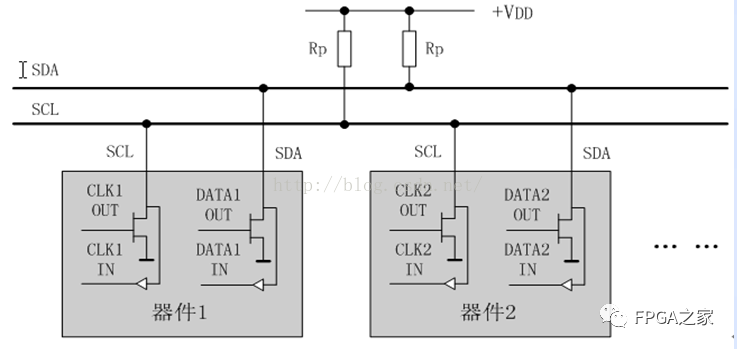
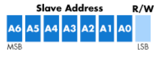
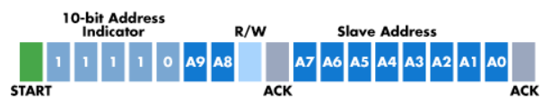
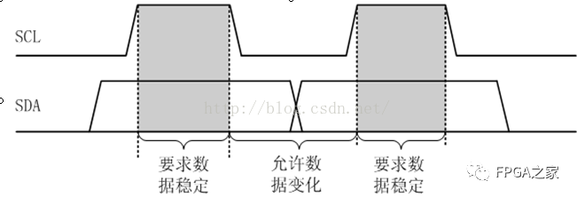
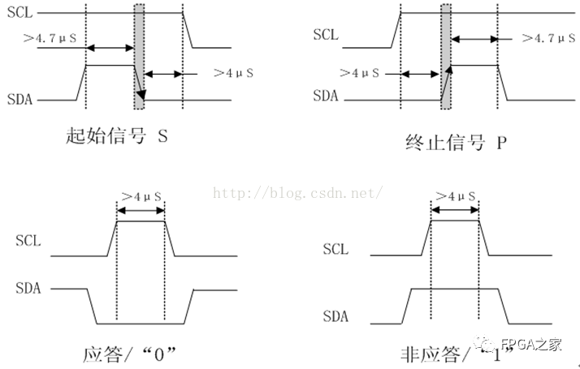

# IIC协议理解

## 一、 特性

### 1. 通信方向

半双工通信

### 2. 总线结构

支持多主多从

### 3. 传输速率

> 标准模式:    100kb/s
> 快速模式:    400kb/s
> 快速模式+:  1Mb/s
> 高速模式:     3.4Mb/s
> 超高速模式: 5Mb/s

## 二、 物理层

两根接线，一根时钟线(SCL)，通信时由主机控制；一根数据线(SDA)，通信时双向传输数据。

两根线都是开漏输出，通信时需要外接上拉电阻。之所以这样是因为，多主机时，如果是推挽输出，一个主机拉高一个主机拉低会短路。



## 三、 协议层

### 1. 传输顺序

先发送数据的高有效位，比如`1011 1100`发送的顺序是：
`1-0-1-1-1-1-0-0`，接收方先收到的是最高有效位`1`。

### 2. 从设备地址

有7位寻址和10位寻址两种：
I2C总线规范规定，标准模式I2C，从机地址为7位长，其次是读/写位。



I2C总线的10bit寻址和7bit寻址是兼容的，这样就可以在同一个总线上同时使用7bit地址和10bit地址模式的设备，在进行10bit地址传输时，第一字节是一个特殊的保留地址来指示当前传输的是10bit地址。



### 3. 时序

- 有效数据
  通信时，在SCL为高电平时SDA上的电平必须保持稳定，在SCL为低电平时，SDA上的数据才可以进行变换。



- 空闲状态
  SCL和SDA都为高电平时，代表总线空闲。



- 起始信号
  
  起始信号由主机发起，在SCL高电平期间，SDA提供一个下降沿

```c
void iic_start(void)
{
    SCL = 1;
    SDA = 1;
    delay_us(5);

    SDA = 0;
    delay_us(5);

/*最后一定要把这个时钟线拉低，因为只有时钟线拉低的时候才允许数据变化*/
    SCL = 0;
}
```

- 结束信号
  
  起始信号由主机发起，在SCL高电平期间，SDA提供一个上升沿

```c
void iic_stop(void)
{
    SCL = 0;
    SDA = 0;
    delay_us(5);
    SCL = 1;
    delay_us(5);

    SDA = 1;
    delay_us(5);
}
```

- 应答信号
  发送端每发送完一个字节(8位)数据，在第9个时钟周期等待接收端返回一个应答信号已确认是否成功接收到了数据。
  主机拉高SCL，读取SDA的电平，低电平为有效应答，高电平为无效应答(NACK)。

```c
/*入参：0-发送NACK，1-发送ACK*/
void send_ack(uint8_t ack)
{
    SCL = 0;

    if(ack)
    {
        SDA = 0;//有效应答
    }
    else
    {
        SDA = 1;//无效应答
    }
    delay_us(5);
    SCL = 1;
    delay_us(5);

    SCL = 0;
}

/*返回值：0-NACK,1-ACK*/
uint8_t wait_ack(void)
{
    uint8_t ack = 0;

    /*释放数据总线*/
    SCL = 0;
    delay_us(5);
    SDA = 1;
    delay_us(5);

    SCL = 1;
    for(int i = 0; i<255; i++)
    {
        if(0 == SDA)
        {
            ack = 1;
        }
    }
    SCL = 0;

    return ack;
}
```

- 读写数据

读写数据都是从最高有效位开始

```c
void iic_send_byte(const uint8_t data)
{
    /*先发送高位bit7*/
    for(int i = 0; i < 8; i++)
    {
        SCL = 0;
        SDA = data & 0x80;
        delay_us(5);
        SCL = 1;
        delay_us(5);
        data <<= 1;
    }

    SCL = 0;
}


uint8_t iic_receive_byte(void)
{
    uint8_t data = 0;

    for(int i = 0; i < 8; i++)
    {
        SCL = 0;
        delay_us(5);
        SCL = 1;
        delay_us(5);
        data <<= 1;
        if(SDA)
        {
            data |= 0x01;
        }
    }

    SCL = 0;
    return data;
}
```

### 4. 通信流程

主机向从机写N个字节

1. 发送起始信号

2. 发送从机地址

3. 等待从机应答

4. 发送一个字节数据

5. 等待从机应答

6. 重复N遍第4和第5步

7. 发送停止信号

主机从从机读N个字节

1. 发送起始信号

2. 发送从机地址

3. 等待从机应答

4. 接收一个字节数据

5. 发送ACK(最后一个字节时发送NACK，告诉从机不要再发送了)

6. 重复N遍第4和第5步

7. 发送停止信号
