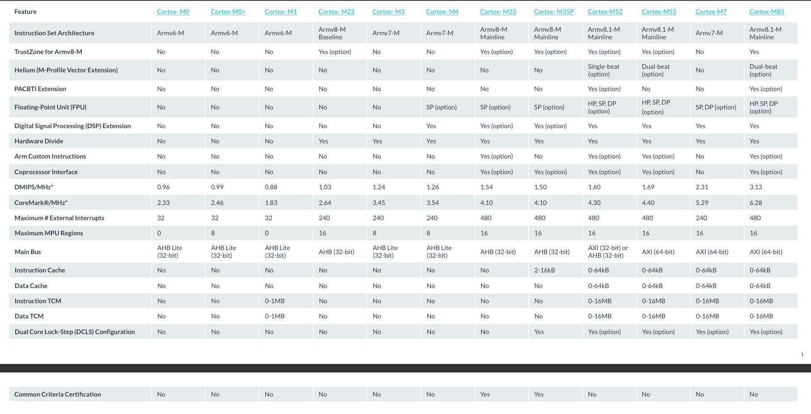

# ARM架构与ARM内核

>> 参考：https://blog.csdn.net/qq_34160841/article/details/105611131
>> [到底什么是Cortex、ARMv8、arm架构、ARM指令集、soc？一文帮你梳理基础概念](https://mp.weixin.qq.com/s?__biz=MzUxMjEyNDgyNw%3D%3D&mid=2247488626&idx=1&sn=c9c045382502de4417a48cf63fffc691&scene=45#wechat_redirect)
>> [认识ARM、Cortex-M内核，以及ARMv8-M架构](https://mp.weixin.qq.com/s?src=11&timestamp=1724484154&ver=5463&signature=OM7Rxb48rmBNLp3*iM44Csv4WW2LkZ7CzYcUiF4lQ9w02SpB9HmHH8rNSYSW9UqCGYW69jh5HN-3wjqQhj2LP*fej4KCa441I3C9Pe8Z8puaLb-Iq3gzerfFfF2r0ZaC&new=1)

## ARM架构

ARM的架构指的是ARM的指令集架构。ARM指令集从1985年ARMv1架构诞生起，到2011年，ARM架构已经发展到了第八代ARMv8。

指令集架构（ISA，Instruction Set Architecture）指的是一组指令的集合，这些指令定义了计算机如何与硬件进行交互。它常被看作软硬件之间的分界面，对软件来说它定义了对CPU操作的机器指令，对硬件来说它定义了对这些操作的硬件实现。具体来说，指令集架构包括以下几个方面：

- 指令格式：指令的编码规则，包括操作码、操作数等字段的结构。
- 指令类型：不同类型的指令，如算数运算、逻辑运算、数据传输、控制流等。
- 寻址方式：指令如何访问操作数，包括直接寻址、间接寻址、立即寻址等方式。
- 寄存器集：可用寄存器的数量和类型，包括寄存器的用途和功能。
- 异常和中断处理：指令集如何处理异常情况和中断请求。

指令集架构分为两类：复杂指令集（CISC）和精简指令集（RISC）。复杂指令集的典型示例是Intel的x86指令集，而精简指令集的典型示例是ARM指令集和MIPS指令集。

## ARM内核

ARM内核是ARM架构的硬件实现，包括了执行器、寄存器、中断控制器、总线接口和调试组件等。内核是由ARM公司设计并授权给个芯片厂商使用的。ARM11内核之后，ARM的内核分为了三个主要系列：

1. Cortex-A系列（A：Application）

   - 应用：主要用于高性能应用，如智能手机、平板电脑和嵌入式设备。
   - 特点：支持高级特性如多核心、先进的功耗管理和虚拟化。大多数Cortex-A内核支持运行复杂的操作系统（如Linux、Android）。
2. Cortex-R系列（R：Real-Time）

   - 应用：专为实时嵌入式应用设计，如汽车、大型工业和其他安全关键系统。
   - 特点：提供高可靠性和低延迟，支持错误检测和修复功能，适应严格的实时要求。
3. Cortex-M系列（M：Microcontroller）

   - 应用：面向低功耗、低成本的微控制器市场，广泛应用于物联网和嵌入式系统。
   - 特点：具有较低的功耗和简单的指令集，易于开发和部署，支持中断处理和实时操作。
   - 
4. Cortex-SC系列（SC：SecurCore）

   除了上述三大系列之外，还有一个主打安全的Cortex-SC系列（SC：SecurCore），主要用于政府安全芯片。

## 对应关系

| 架构版本 | 内核版本                                       |
| -------- | ---------------------------------------------- |
| ARMv1    | ARM1                                           |
| ARMv2    | ARM2、ARM3                                     |
| ARMv3    | ARM6、ARM7                                     |
| ARMv4    | StrongARM、ARM7TDMI、ARM9TDMI                  |
| ARMv5    | ARM7EJ、ARM9E、ARM10E、XScale                  |
| ARMv6    | ARM11、Cortex-M0、Cortex-M0+、Cortex-M1        |
| ARMv7    | Cortex-M3、Cortex-M4、Cortex-M7                |
| ARMv8    | Cortex-A50、Cortex-A70、Cortex-M33、Cortex-M55 |

## ARM授权

ARM公司既不生产芯片也不出售芯片，它只销售芯片设计的授权。ARM授权分为ARM架构授权、IP核授权、使用层级授权。

1. 架构层级授权

   是指可以对ARM架构进行大幅度改造，甚至可以对ARM指令集进行扩展或缩减，苹果就是一个很好的例子，在使用ARMv7-A架构基础上，扩展出了自己的苹果swift架构
2. 内核层级授权

   是指可以以一个内核为基础然后在加上自己的外设，比如USART、GPIO、SPI、ADC等等，最后形成了自己的MCU，这种公司很多，比如ST、TI
3. 使用层级授权

   要想使用一款处理器，得到使用层级的授权是最基本的，这就意味着你只能拿别人提供的定义好的ip来嵌入在你的设计中，不能更改人家的ip，也不能借助人家的ip创造自己的基于该ip的封装产品。
