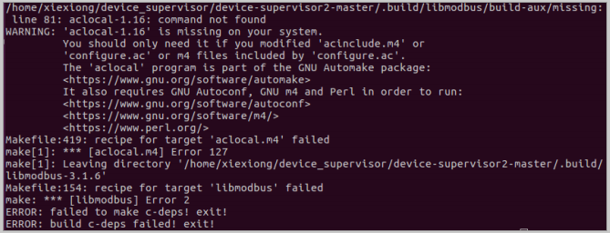
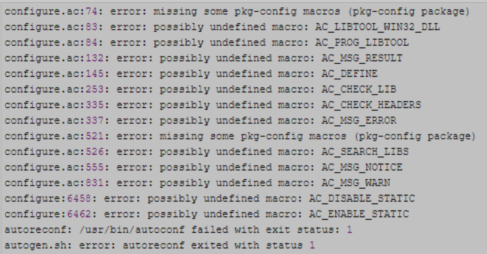
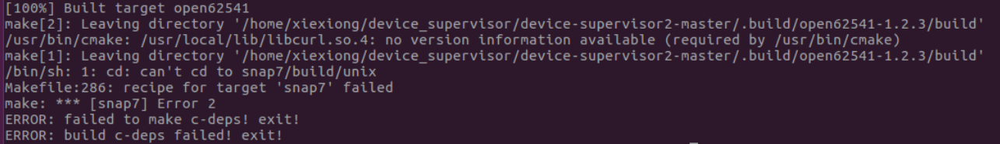
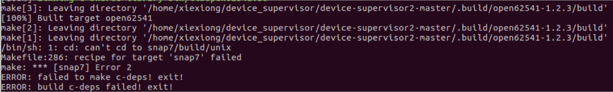

# Device-Supervisor编译环境

## 一、环境

1. Ubuntu1-V16.04
2. VirtualBoxl-V6.1.40

## 二、交叉编译工具链安装

> 参考:<https://blog.csdn.net/weixin_53811793/article/details/116586043>

1. 进入交叉编译工具链目录下,`buildroot-2017.02.5/output/host/opt/ext-toolchain/bin`

2. 配置环境变量
   
   - 输入`pwd`,查看当前路径
   
   - 打开`~/.bashrc`
   
   - 在末尾添加`export PATH=$PATH:{工具链路径}`，保存退出
   
   - 输入`source ~/.bashrc`,立即生效
   
   - 输入`echo $PATH`,查看是否添加上了

3. 验证配置是否成功
   
   输入`arm-linux-gnueabihf-gcc -v`

4. 在`buildroot-2017.02.5/output/host/opt/ext-toolchain/bin`下创建个软链接
   
   `sudo ln -s arm-linux-gnueabihf-readelf arm-linux-readelf`

## 三、第三方库安装

1. 安装openssl和openssl-dev、libffi-dev
   
   ```bash
   sudo apt-get install openssl
   sudo apt-get install libssl-dev
   sudo apt-get install libffi-dev
   ```

2. 安装Python3.7.2和python3-dev，修改python3指向python3.7.2
   
   参考：<https://www.cnblogs.com/wangyuxing/p/10542330.html>
   
   ```bash
   # 安装python3-dev
   sudo apt install python3-dev
   
   # 修改python3指向
   sudo rm -r /usr/bin/python3
   sudo ln -s {安装路径}/bin/python3.7 /usr/bin/python3
   ```

3. 安装安装automake-1.16、autoconf-2.69、libtool-2.4.6、m4-1.4.13

4. 安装libxml2-dev和libxslt-dev
   
   ```bash
   sudo apt-get install libxslt-dev 
   sudo apt-get install libxml2-dev
   ```

5. 安装cmake
   
   ```bash
   sudo apt install cmake
   ```

6. 安装p7zip
   
   ```bash
   sudo apt install p7zip
   ```

## 四、编译指令

```bash
./build.sh gnu
```

## 五、编译报错解决

1. aclocal.m4报错
   
   未安装指定版本automake
   
   

2. AC_PROG_LIBTOOL报错
   
   参考：<https://www.cnblogs.com/y4247464/p/14388334.html>
   
   

3. cmake未安装报错
   
   参考:<https://blog.csdn.net/HHHHHHHHHH0622/article/details/102669513>
   
   

4. snap无法解压报错
   
   未安装7z解压工具
   
   
