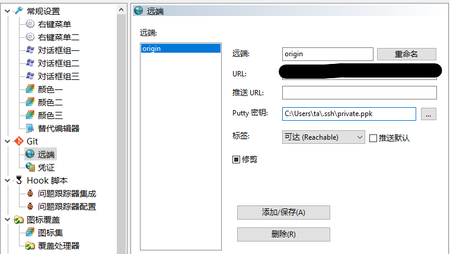

# TortoiseGit-安装使用

## 一、安装TortoiseGit

官网:<https://tortoisegit.org/download/>

## 二、安装中文语言包

官网:<https://tortoisegit.org/download/>

## 三、导入私钥

1. 找到`id_rsa`文件
   
   ```bash
   // 进入.ssh文件夹
   $ cd ~/.ssh
   // 查看当前文件目录
   $ pwd
   ```

2. 打开`PuTTYgen.exe`

在`TortoiseGit`安装目录下的`bin`文件找到`PuTTYgen.exe`打开
点击`Load`，进入上面的路径，加载`id_rsa`文件（不带后缀的）

3. 生成`.ppk`格式私钥

点击`Save private key`,还是保存在上面那个`.ssh`文件夹，名称随意，保存格式为`.ppk`

## 四、配置远端

在设置的远端里配置刚才的密钥路径


