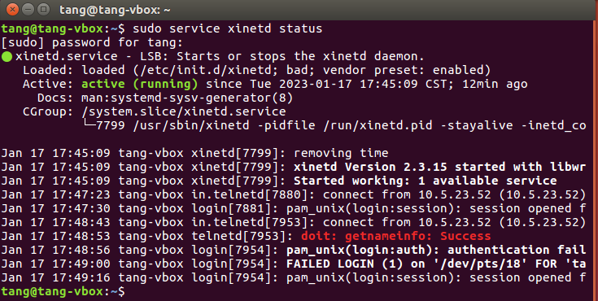
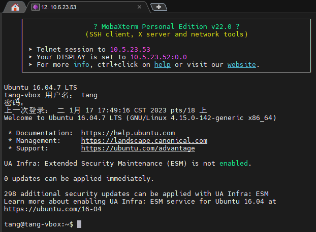

# Ubuntu+Telnet

## 环境

1. Ubuntu16.04
2. VirtualBox6.1.40
3. MobaXterm22.0

## Ubuntu安装telnet

1. 查看telnet运行状态
   
   ```bash
   # 返回空，表示没有开启服务
   netstat -a | grep telnet
   ```
2. 安装Telnet 服务器
   
   ```bash
   sudo apt install telnetd
   ```
3. 安装网络守护进程服务程序来管理它
   
   ```bash
   sudo apt install xinetd
   ```
4. 查看服务状态
   
   

## MabaXterm连接

1. 新建一个Session，选择telnet终端

2. 填写远程host，username可以不填

3. 稍等一会，终端会要求输入用户名和密码
   
   


