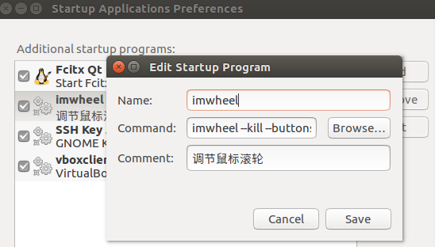

# Ubuntu设置鼠标参数-imwheel

## 安装imwheel

```bash
sudo apt update

sudo apt install imwheel
```

## 配置imwheel

```bash
sudo gedit ~/.imwheellrc

# 写入如下配置
".*"
None,      Up,   Button4, 3
None,      Down, Button5, 3
Control_L, Up,   Control_L|Button4
Control_L, Down, Control_L|Button5
Shift_L,   Up,   Shift_L|Button4
Shift_L,   Down, Shift_L|Button5
None,      Thumb1,  Alt_L|Left
None,      Thumb2,  Alt_L|Right

# 删除进程,重新启动
killall imwheel
imwheel
```

> - 首行中`".*"`用来指定在哪些应用中生效，`".*"`表示全部应用生效。
> - 2、3行最后的数字是设置的滚轮速度。
> - 4、5行设置支持 左Ctrl+滚轮 操作。（缩放）
> - 6、7行设置支持 左Shift+滚轮 操作。
> - 8、9行设置支持鼠标侧健。

## 设置开机自启动

```bash
gnome-session-properties

imwheel --kill --buttons "4 5"
```




