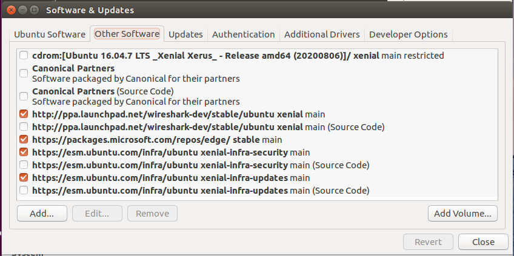

# Ubuntu软件源删除

## 环境

VirtualBox6.1.40+Ubuntu16.04

## 一、通过Software&Updates



## 二、终端命令

```bash
# 添加ppa地址
sudo apt-add-repository ppa:PPA_Name/ppa
# 删除ppa地址
sudo add-apt-repository --remove ppa:PPA_Name/ppa
```

## 三、从源列表中

```bash
sudo ls /etc/apt/sources.list.d
sudo rm -i /etc/apt/sources.list.d/PPA_Name.list
```
