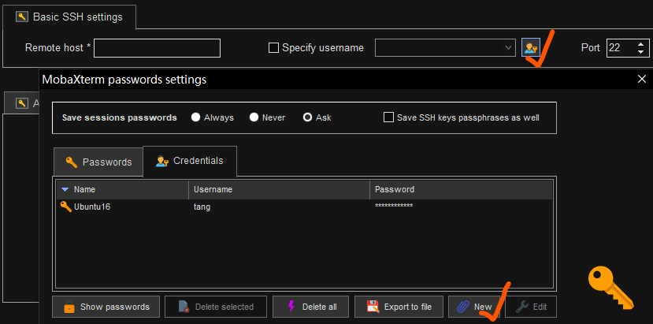
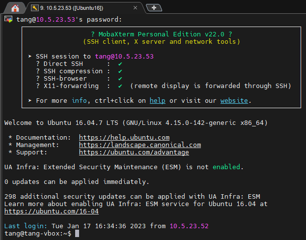

# VirtualBox+Ubuntu+SSH

## 环境

1. VirtualBox6.1.40
2. Ubuntu16.04
3. MobaXterm22.0

## Ubuntu安装启动SSH

1. 查看SSH服务有没有启动
   
   ```bashag-0-1gmvep22iag-1-1gmvep22i
   # 结果中没有出现sshd，很可能没有装
   ps -e|grep ssh
   ```

2. 安装ssh-server
   
   ```bash
   # 安装之后是默认开机自启动服务的
   sudo apt install openssh-server
   ```

3. 相关指令
   
   ```bash
   sudo /etc/init.d/ssh start   #启动ssh服务
   sudo /etc/init.d/ssh stop    #停止ssh服务
   sudo /etc/init.d/ssh restart #重启ssh服务
   ```

## MobaXterm配置

1. 新建一个Session,选择SSH

2. 填写远程host

3. 创建新的凭证
   
   

4. 勾选Specify username,选择刚才创建的凭证

5. 连接后需要输入密码，也有方法可以配置成免验证
   
   
