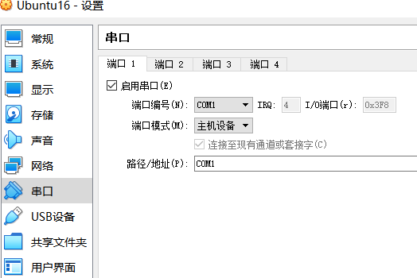
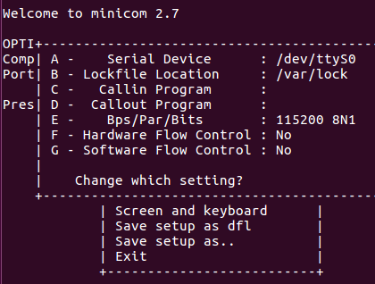

# VirtualBox+Ubuntu下使用电脑串口

## 配置

1. 使用VSPD创建一对虚拟串口
2. VirtualBox里启用串口，设置对应的串口编号，端口模式设为主机设备（试了下主机管道，虚拟机接收数据有些问题），路径/地址填写对应串口编号

## 测试

1. Ubuntu安装minicom串口工具`sudo apt-get install minicom`

2. 启动minicom`sudo minicom`

3. `Ctrl+A+O`配置参数，选择`Save setup as dfl`保存配置。
   
   

4. 重新登录minicom，在主机中打开一款串口工具，就可以进行看到收发的数据啦，默认minicom发送的数据回显是关掉的，`Ctrl+A+Z`进入帮助查看命令打开回显。

