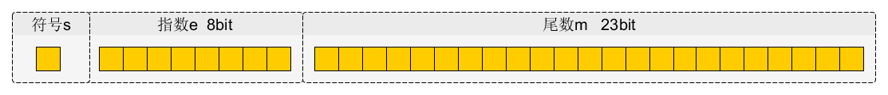

# 编码-数字

在计算机中一切都是以二进制数来表示的，不管是数字、文本，或是图片、音频、视频，都是以二进制进行存储和处理的。

显然，计算机的语言是二进制但人类并不是，在这两者之间需要一定的转化。

将事物转化成数字的形式叫做编码，将数字还原成事物叫做解码。

## 1.整数

### 1.1 无符号整数

在计算机中对于无符号整数，是以二进制真值来进行存储的。

比如说：数字`20`在计算机中存储就是`0000 10100`，`2020`就是`0111 1110 0100`。

并且在计算机中，存放数字的最小空间是1个字节，也就是8个比特位。存放`1`就是`0000 0001`，存放`100`就是`0110 0100`。放不下，就用16位，32位、64位来放。

### 1.2 有符号整数

所谓有符号数就是区分正负的数字，比如说`+10`和`-10`。这里采用的方式是专门用一位二进制来表示正负号。

规定二进制的最高位表示正负，`0`代表正数，`1`代表负数。`+10`就是`0000 1010`，`-10`就是`1000 1010`。这样直接的表示，叫做原码。

但是这样表示会出现一个问题`0000 0000`和`1000 0000`都可以表示`0`。所以在计算机中是用另一种形式-补码，来表示有符号整数的。
**补码**：非负数的补码是其原码本身；负数的补码是其最高位（符号位）保持不变，其它位取反(即反码)，再加1。

负数的转换需要经过原码->反码->补码的过程

比如十进制的-10，转换为二进制**原码**：`1000 1010`

**反码**：`1111 0101`

**补码**：`1111 0110`
具体可以看下这篇文章：<https://blog.csdn.net/afsvsv/article/details/94553228>

## 2.小数

### 2.1 定点表示法

定点数表示法， 这种表示方法将小数点的位置固定在某一个位置,比如: 11001000.00110001,这个16位(2字节) 的定点数用前面8位表示整数部分，后面8位表示小数部分，这种方法直观，但是固定的小数点位置决定了固定位数的整数部分和小数部分，不利于同时表达特别大的数或者特别小的数。

### 2.2 浮点表示法

绝大多数现代计算机遵循IEEE754,即IEEE二进制浮点数算数标准，利用科学计数法来表示小数，即用**一个尾数**，**一个基数**，**一个指数**以及**一个符号位**来表示小数。

比如 123.45 用十进制科学计数法可以表达为 1.2345 × 10^2 ，其中1.2345 为尾数，10 为基数，2为指数。浮点数利用指数达到了浮动小数点的效果，从而可以灵活地表达更大范围的实数。
在IEEE标准中，浮点数在内存中的表示是将特定长度的连续字节的所有二进制位按特定长度划分为符号域，指数域和尾数域三个连续域。 例如，对于float类型的数据，其在内存中的表示为：

- 第一位s代表符号位，1代表负数，0代表正数。
- 第二个域是指数域e，对于单精度float类型，指数域有８位，可以表示0-255个指数值。指数值规定了小数点的位置，小数点的移动代表了所表示数值的大小。但是指数可以为正数，也可以为负数。为了处理负指数的情况，实际的指数值按要求需要加上一个偏差值作为保存在指数域中的值，单精度数的偏差值为 -127，而双精度double类型的偏差值为 -1023。比如，单精度指数域中的值为130，则表示实际的指数值=130-127=3。 偏差的引入使得对于单精度数，实际可以表达的指数值的范围就变成-127 到 128 之间（包含两端）。实际的指数值-127（保存为 全 0）以及 +128（保存为全1）保留用作特殊值的处理。这样，实际可以表达的有效指数范围就在 -126 和 +127 之间。
- 第三个域为尾数域M，其中单精度数为 23 位长，双精度数为 52 位长。

**Float = s * 2^e-127^ * M**

举个栗子：*将小数9.9转化为浮点数*

- 首先将`9.9`转换成24位二进制`1001 . 1110 0110 0110 0110 0110`
- = `1 . 0011 1100 1100 1100 1100 110` * `2^3`，
- 这里小数点前肯定是1，所以不需要存储。这样尾数域就是小数点的23位
- 指数值`e = 3 + 127 = 130 = 1000 0010`
- 符号位 = 0
- 9.9 = `0 1000 0010 0011 1100 1100 1100 1100 110`

0100 0001 0001 1110 0110 0110 0110 0110
     4      1      1       E        6       6       6       6 

在线进制转换网站：<https://lostphp.com/hexconvert/>