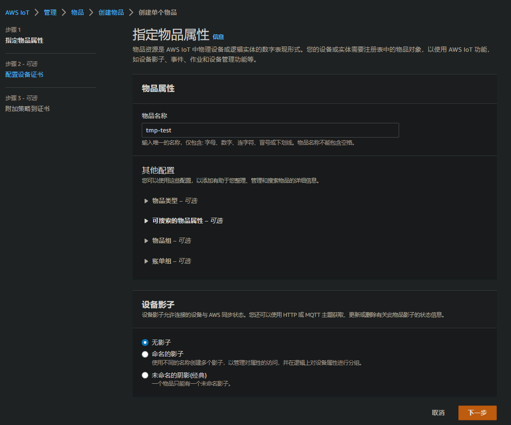
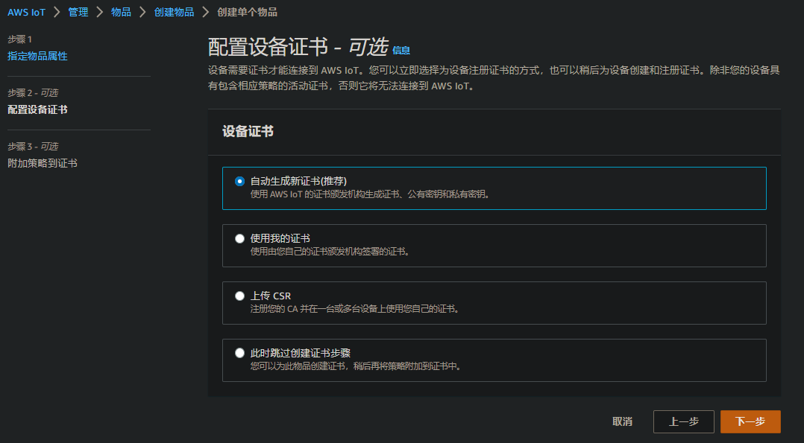
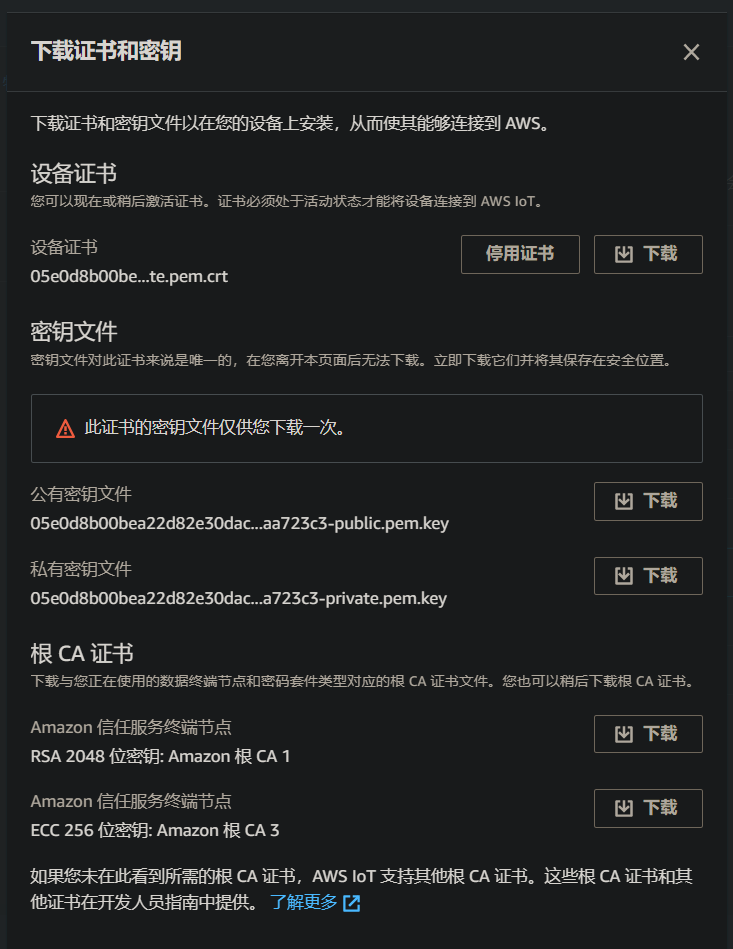
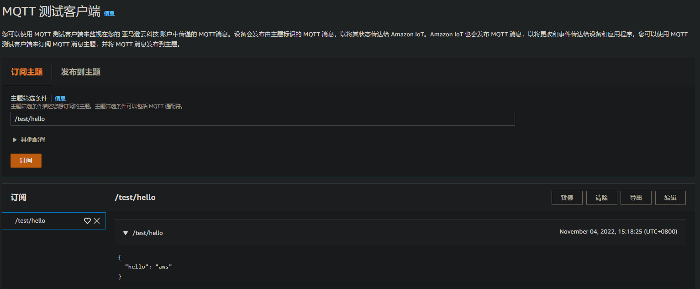
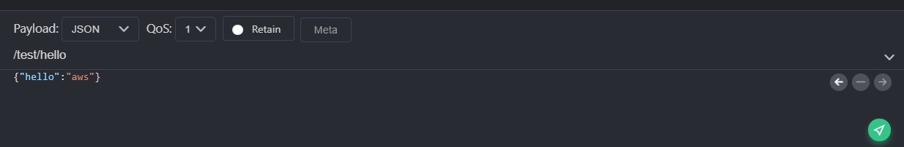

# AWS设备接入-MQTT方式

> 官网:[https://console.amazonaws.cn/](https://console.amazonaws.cn/)
> 
> 开发文档:<https://docs.amazonaws.cn/iot/latest/developerguide/what-is-aws-iot.html>

## 一、准备

1. AWS账号

2. MQTT客户端:桌面端软件[MQTTx](https://mqttx.app/zh)

## 二、设置

1. 进入*Amazon IoT*创建一个物品

2. 指定物品属性，输入名称，其它可选项先不管



3. 配置设备证书，按推荐的来



4. 附加策略到证书，需要先创建一个策略,下面这个策略是允许所有操作(所谓策略，就是可以对连接、发布、订阅和证书做一些限制)

```
{
"Version": "2012-10-17",
"Statement": [
 {
   "Effect": "Allow",
   "Action": "*",
   "Resource": "*"
 }
]
}
```

5. 下载证书，注意这里的**证书密钥**只能在这里下载一次，一定要保存好，不然只能重新创建证书了



## 三、连接测试

1. **ClientID**随机生成一个，因为刚才的策略没有做限制
2. **服务器地址**在设置那里的终端节点
3. **端口**为8883
4. 用户名和密码填空
5. 开启SSL/TLS和SSL安全，证书类型选择Self signed
6. CA文件导入刚下载的CA证书，客户端证书导入设备证书，客户端key文件导入私有密钥文件
7. 使用MQTTx连接服务器，向某个topic发布一个消息，在AWS的MQTT测试客户端上订阅该消息，正常应该能收到




