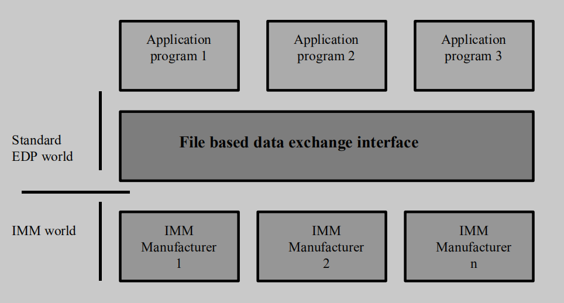
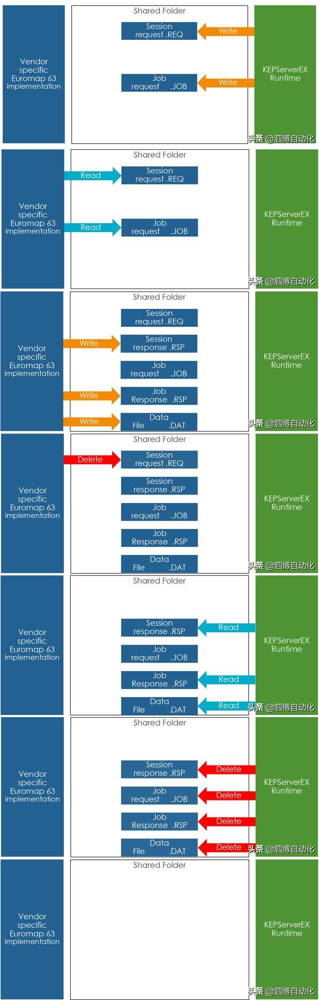

# Euromap 63协议认识

## 一、用途

Euromap 63是欧洲塑料和橡胶机械制造商协会颁布的专用于注塑机和上位计算机进行数据交互的协议，全称"Euromap 63/SPI"(SPI=塑料工业协会)。Euromap 63的目标是为不同制造商的注塑机的中央计算机接口设立标准，从而降低用户编制与机器通信的软件的成本。

## 二、框架

Euromap 63是一种基于文件共享的通信协议，注塑机和上位机共享同一个文件目录，通过读写文件的方式来交互。比如说上位机向目录中写入一个request.REQ文件发起一个请求，注塑机读取这个文件，处理之后再写入一个response.RSP文件，上位机读取它获取结果。

协议只规定了文件交互的流程和格式，并没有规定使用哪种文件共享协议。目前调研来看使用FTP协议的比较多，并且一般是注塑机作为client，上位机作为server来维护共享目录。

协议按照OSI七层模型来组织的，但是对会话层以下的并没有详细规定。
会话层规定了会话请求文件（SESSnnnn.REQ）和响应文件（SESSnnnn.RSP）的格式。会话层只有两个请求命令：

- CONNECT
- EXECUTE

表示层规定了命令文件（XXX.JOB）和响应文件（XXX.RSP）的格式。表示层有有七个请求命令：

- REPORT
- SET
- ABORT
- UPLOAD
- DOWNLOAD
- GETINFO
- GETID

应用层规定了注塑机参数名称的格式以及命令结果（XXX.DAT）的格式。应用层没有请求命令。

## 三、交互

1. CONNECT:验证连接
   
   1.1 上位机写入一个REQ文件和一个JOB文件
   
   1.2 注塑机读取请求，之后写入两个响应文件，再删除REQ文件
   
   1.3 上位机读取响应文件，删除剩余文件

2. REPORT:获取注塑机参数
   
   2.1 上位机写入一个REQ文件和一个JOB文件
   
   2.2 注塑机读取请求，之后写入三个响应文件，再删除REQ文件
   
   2.3 上位机读取响应文件，删除剩余文件

3. SET:设置注塑机参数
   
   3.1 上位机写入一个REQ文件和一个JOB文件
   
   3.2 注塑机读取请求，之后写入两个响应文件，再删除REQ文件
   
   3.3 上位机读取响应文件，删除剩余文件

4. GETID:获取注塑机支持的参数列表
   
   4.1 上位机写入一个REQ文件和一个JOB文件
   
   4.2 注塑机读取请求，之后写入三个响应文件，再删除REQ文件
   
   4.3 上位机读取响应文件，删除剩余文件

## 四、参考信息

1. [工业物联网 凌顶发布注塑机通讯协议Euromap 63 的 OPCUA 驱动组件_东洋注塑机以太网说明书_无锡凌顶科技的博客-CSDN博客](https://blog.csdn.net/qq_36700574/article/details/123368251)

2. [kepware怎么读modbus/tcp数据_注塑机设备联网？EUROMAP 63？Kepware快速帮您搞定！_weixin_39863631的博客-CSDN博客](https://blog.csdn.net/weixin_39863631/article/details/110102987)

3. 这个软件支持Euromap63协议读取注塑机参数：[KEPserverEX OT 连接平台 | PTC](https://www.ptc.com/cn/products/kepware/kepserverex)
