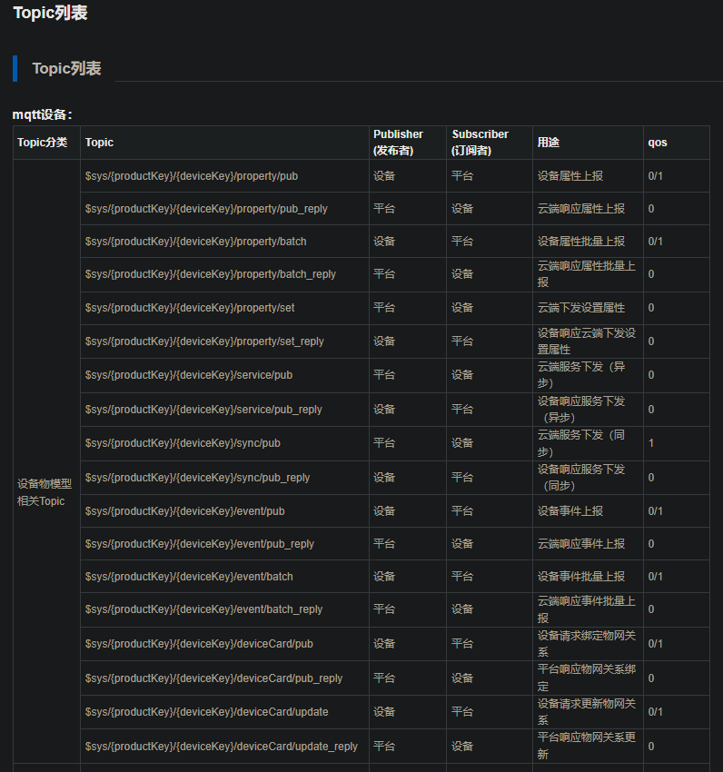

# 格物云设备接入-MQTT方式

> 官网:<https://dmp.cuiot.cn/>
> 开发文档:<https://dmp.cuiot.cn/#/onlineDocument/display?articleId=215&articleTypeId=0>

## 一、准备

1. 格物云账号
2. MQTT客户端：桌面端软件[MQTTx](https://mqttx.app/zh)

## 二、设置

1. 新建产品
2. 编辑物模型
3. 新建设备
4. 具体操作见官方文档

## 三、连接测试

1. 测试上线方式为一机一密

2. **地址和端口**: MQTT:dmp-mqtt.cuiot.cn:188,MQTTS:dmp-mqtts.cuiot.cn:8883

3. **ClientID**:{deviceId}|{productKey}|{signMethod}|{authType}|{operator}
   例：89*********76|cu1********fgh|0|0|1
- deviceId：表示客户端ID，与operator字段搭配使用，若operator字段填写的为“1”、“2”、“3”、“4”时，请填写物联网卡的ICCID，operator填写为“0”时，请填写设备的SN码或者MAC地址，10-32个字符以内，只支持数字，大小写字母及“-”。

- productKey：表示产品Key，可从平台产品或设备界面获取。

- signMethod：表示加密算法类型，当前平台支持hmac_sha256和SM3，hmac_sha256用“0”标识，SM3算法用”1”标识。

- authType：表示认证方式类型，此处一机一密则使用“0”。

- operator：表示运营商标识符，当设备使用物联网卡时，该标识符请填写“1”（联通），“2”（移动），“3”（电信），“4”（广电），若未使用蜂窝网络接入，请填写“0”。(PS:官网是这么描述的，但我实际测试发现只有填'0'才能连上)
3. **UserName**:{deviceKey}|{productKey}
   例：mqttTest|cu1********fgh

4. **PassWord**:密文字符串

第一步将deviceId， deviceKey，productKey参数值依次进行拼接，

第二步使用ClientId中的加密算法标识符对应的算法，使用deviceSecret对拼接参数进行加密；加密计算格式为hmac_sha256(deviceIddeviceKeyproductKey,deviceSecret)或者SM3(deviceIddeviceKeyproductKey,deviceSecret)

在线加密：[HMAC在线加密工具 - MKLab在线工具](https://www.mklab.cn/utils/hmac)

5. 发布数据

发布数据必须往允许的Topic发布才有效，订阅也只能订阅允许的不然会失败。

发布的Payload格式也必须按照平台规定的，具体见官方文档描述。

上传的数据可以在设备数据中看到，这里测试发现key必须全都正确，不然批量上报会返回错误，value的类型也必须上报正确。

