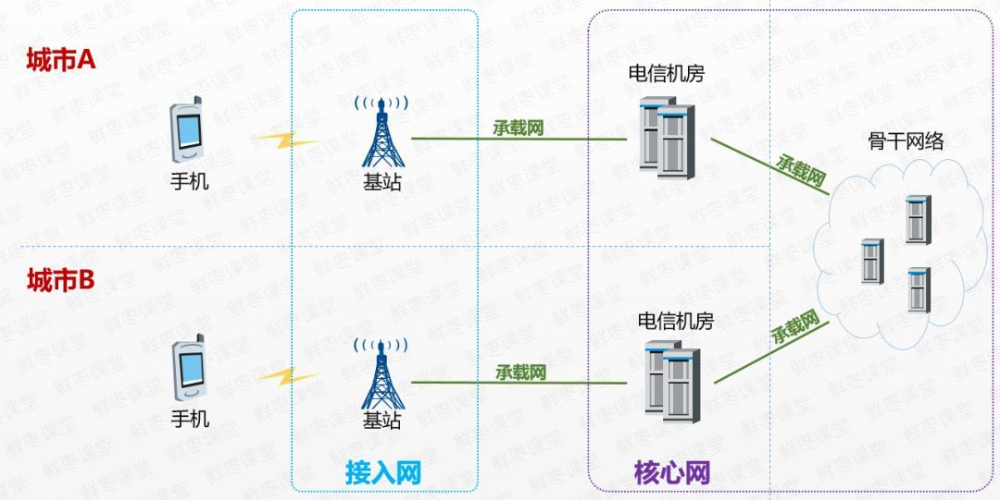
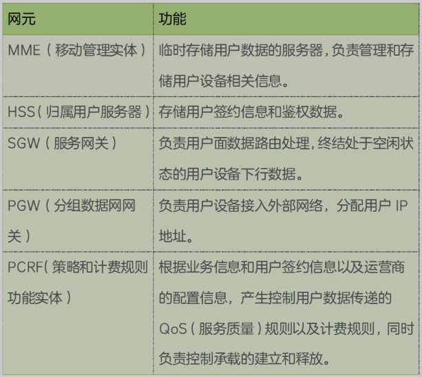

# 移动通信网络认识

## 主要组成

1. 接入网-收发信息
2. 承载网-传输信息
3. 核心网-处理信息

## 接入网

将移动设备加入通信网络的前站，也是最先处理移动信号的地方，基站就是属于无线接入网。它的主要功能是对信息进行调制解调。

## 承载网

物理上，承载网包括光纤、微波、卫星等；技术上，承载网包括SDK、ATM、IP/MPLS。现在为了迎接5G挑战，承载网又必须提供超大带宽、超低时延，还要支持网络切片和灵活调度。它的主要功能是传输海量信息。

## 核心网

核心网主要由5个网元组成：MME、HSS、SGW、PWG、PCRF。分配IP就是在这里进行的，大部分移动设备会被分配一个内网地址，然后通过NAT技术连接外部网络。

## 举例

当我们用手机刷B站视频时，通信链路是这样的：
手机->基站->承载网->核心网->承载网->B站服务器->承载网->核心网->承载网->基站->手机
